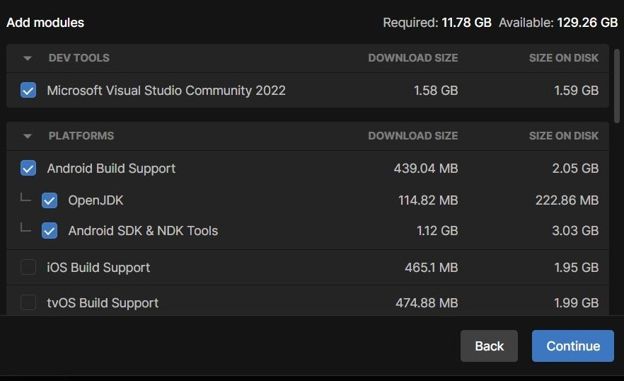
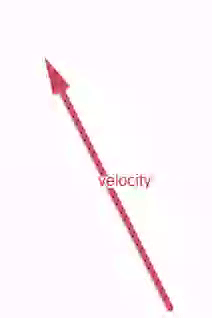
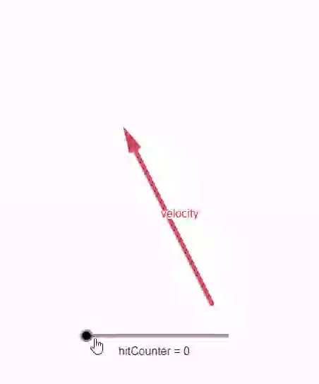
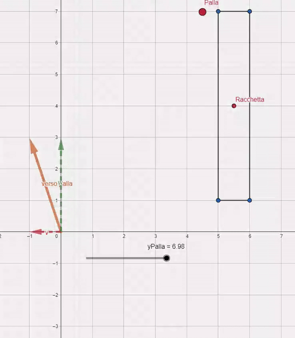

# Unity

Unity è un motore per lo sviluppo di giochi versatile che consente di creare esperienze interattive in tempo reale, in particolare può essere anche molto immediato per lo sviluppo di prototipi.

## Perché usare Unity

1. **Facilità d’uso:**  è potente e facile da usare. Unity è un IDE ovvero un ambiente di sviluppo integrato quindi potete costruire il vostro gioco usando l’interfaccia integrata, navigando cartelle di vostri assets e trascinando e rilasciando gli elementi che vi servono per costruire una scena.
2. **Risparmiare tempo:**  Oltre ad offrire un motore di gioco già pronto e personalizzabile(motore che non deve essere sviluppato da zero da un apposito team), offre un'ampia gamma di tecnologie, tool e librerie gratuite per velocizzare lo sviluppo della maggior parte di tipi di gioco(funzionalità integrate come fisica, rendering, rilevamento delle collisioni, ecc ecc)
3. **Scripting :**  Il linguaggio di programmazione usato per lo scripting è C#(OOP), Unity di base fornisce molte classi e API. La buona notizia è che si può fare moltissimo senza dover gestire molto codice.
4. **Prototipare:**  Essendo immediato da usare(editor e scripting) e mettendo a disposizione  tool e librerie è possibile creare prototipi molto velocemente.
5. **Personalizzazione:**   Ovviamente gli sviluppatori possono sviluppare tool e librerie più specifiche per realizzare il proprio gioco senza usare quelle fornite dal motore.
6. **Sviluppatori indipendenti:**  Le tecnologie più avanzate offerte da Unity permettono di sviluppare titoli in grado di competere con aziende più grandi
7. **Tutorial ufficiali:**  Unity offre una serie di tutorial ufficiali sulle tecnologie e gli strumenti dell'editor, compresi i design pattern di programmazione, disponibili sul loro canale YouTube. Inoltre da qualche tempo Unity.
    1. Sicuramente non avrete tempo di adottare un design pattern per il vostro progetto. Ma vi ricordo che se volete diventare dei professionisti l'uso dei design pattern aiuta gli sviluppatori a scrivere codice più pulito, più flessibile, più facilmente manutenibile e comprensibile, promuovendo anche la riusabilità del codice e la standardizzazione delle pratiche di sviluppo. In sostanza, sono strumenti potenti per migliorare la qualità complessiva del software.
8. **Community enorme ed attiva sul web:**  grazie alla vastità della community è possibile trovare una guida per qualsiasi cosa e anche per la maggior parte dei problemi che potreste incontrare
9. **Multipiattaforma:**  consente di esportare su varie piattaforme (Web, Windows, Android, macOS, Linux, iOS, PlayStation, Xbox, Nintendo Switch) 
10. **Assets store:** è possibile vendere assets o vendere assets sull’assets store.
11. **Tante possibilità:** Unity è più di un motore di gioco, potete creare contenuti 3D interattivi in tempo reale. Ad oggi sviluppatori di giochi, artisti, architetti, progettisti automobilistici, cineasti e molti altri usano Unity
12. **Gratis(non completamente):** Pubblicare i propri contenuti con unity è gratuito sotto una certa soglia di installazioni. È possibile informarsi sulle tariffe sul sito ufficiale. 
13. **Bonus/Unity Muse(pagamento):**  Unity offre in abbonamento uno strumento basato su AI, interrogabile in linguaggio naturale(simile a chat gpt), utilizzabile da sviluppatori con qualsiasi grado di esperienza che permette di velocizzare il processo di realizzazione di un prototipo di gioco permettendo di: 
    1. **Idee e risolvere problemi:**  Risolvi problemi complessi, ottenere idee per il tuo progetto e  analizzare e generare il codice che scrivete.
    2. **Sprite e assets:**  Creare sprite e texture in base a parametri specificati nel prompt
    3. **Animare:**  Animare personaggi umanoidi con pochi suggerimenti di testo, risparmiando ore di configurazioni tradizionali, progettate sia per aspiranti che per animatori esperti
    4. **Behavior:**  Possibiltà di descrivere i comportamenti delle vostre entità di gioco e far prendere vita le vostre entità tramite alberi di comportamento
14. **Bonus/(WEB)Partership Google:**  Unity ha da poco intrapreso una partnership con google per il supporto di web application(anche browser mobili) compilabili da Unity. Questo permetterà di esportare interi progetti in app eseguibili su browser web. Questa partership permette di utilizzare api chiamata WebGPU che permette di esporre fino al browser la capacità di calcolo della GPU in maniera efficiente. Immaginare la possibilità di far provare o di distribuire le vostre esperienze interattive a qualsiasi utente senza dover passare la distribuzione degli store dei dispostivi.

## Installazione Editor

1. **Scaricare e installare Unity Hub:** consente di gestire i tuoi progetti e di installare le versioni di unity
2. **Installare versione di Unity(LTS):** Unity LTS (Long Term Support) è una versione di Unity che offre massima stabilità e supporto per i tuoi progetti. Installare tramite hub la versione di unity che useremo per la creazione del nostro prototipo/gioco
3. **Scelta dei componenti:** Scegliere i moduli essenziali per lo sviluppo del prototipo. In questo caso sarà essenziale selezionare il Dev tools IDE visual studio, è gli sdk della piattaforma di destinazione su cui pensate di far girare il vostro gioco. (consigliati android e windows)
    
    
    

 

## Creazione progetto e assets

1. **Creare nuovo progetto 2D:** Crea un nuovo progetto dall’Hub di Unity e tra i template seleziona “2D (Built-In Render Pipeline). Conterrà il numero minimo di tool utile a questo tutorial.
2. **Scaricare gli assets:** Assets utili a costruire le scene del nostro esempio.
Usare il link: https://drive.google.com/file/d/1VfwIRqDaxyp-t7_1nubnTiTgwLJrqAHz/view
oppure:
    
    [Pong Assets.zip](Pong_Assets.zip)
    
    
    
3. **Importare gli sprite:** Dopo aver scaricato lo zip con gli assets, dalla scheda “*Project*” dell’editor di unity creare una nuova cartella sprite e inserire all’interno il contenuto del file zip.

## Configurazione della scena

1. **Inserire gli sprite nella scena:** Trascinare uno per uno gli sprite nella finestra dell’editor chiamata “*Hierarchy*”
2. **Aspect Ratio:** Nella finestra dell’editor usiamo l’aspect ratio 16:9 per comodità, si potrebbe usare qualsiasi formato. (Idealmente un gioco multipiattaforma dovrebbe potersi adattare a qualsiasi formato/risoluzione)
3. **Sfondo/bound gioco(*Basic Background*):** Nella finestra “*Hierarchy*” selezionare il gameobject “*Basic Background*” e dalla finestra “*inspector*” modificare/aggiungere i seguenti componenti
    1. **Transform:** Selezionare il componente `Transform` dalla finestra *Inspector* dell’editor e modificare il valore dell’attributo `Scale` del gameobject (.7, .7, .7) in modo che si adatti a schermo. (questi valori che stiamo impostando sarebbero come dei parametri del costruttore del gameobject che verrà istanziato a runtime)
    2. **Collider:** aggiungere il componente polygon collider 2D. Questo componente calcola quali sono i contorni del gameobject su cui calcolare le collisioni. Lo fa partendo dai pixel dello sprite che non sono trasparenti(ovviamente con una certa tolleranza rispetto ai pixel alpha)
4. **Palla gioco(*Basic Ball*):** selezionare il gameObject della palla
    1. **Collider:** aggiungere il componente `circle collider 2D`
    2. **Rigidbody 2D:** aggiungere il componente `*Rigidbody 2D`.* Questo componente coinvolgerà questo gameobject nel calcolo della fisica nell’intera scena. Questo permette di subire la gravità, la fisica degli altri gameobject e a sua volta di influenzare gli altri gameobject che dispongono di fisica nella scena
        1. **Settare attributi Rigidbody 2D:** non vogliamo che la palla subisca alcuna forza di gravità. Quindi settare l’attributo `*Gravity Scale`* del componente `*RigidBody`* a 0.
        2. **Qualità Collision Detection:** Il valore di default per l’attributo `Collision Detection` è `Discrete` . Questa è computazionalmente meno impegnativa ma meno affidabile per i gameobject che si muovono rapidamente e subiscono collisioni come nel caso della palla. Quindi impostiamo l’attributo in `Continuos` per la collision detection.
        3. **Vincoli sulla rotazione:** Non ci interessa che l’oggetto ruoti sull’asse Z quindi selezioniamo l’asse `Z` nell’attributo `Constraints`, `Freeze Rotation`
        
        4. **Creare 2D/PhysicsMaterial2D:** Creiamo un nuovo physics material 2D(asset) configuriamo con *friction = 0* e *bounciness = 1.* Trasciniamo questa configurazione di materiale fisico all’interno del componente fisica della palla
        
5. **Racchette(*Basic Racket-AI)*:** selezionare il gameObject della racchetta
    1. **Transformer:** spostiamo la racchetta di gioco modificando l’attributo `position` del componente `Transform` (7.5, 0, 0)
    2. **Sdoppiamo la racchetta:** sdoppiamo la racchetta e spostiamola alle coordinate opposte (-7.5, 0, 0)
    3. **Rinominiamo racchetta:** cambiamo il nome di una racchetta in AI Racket
    4. **Box Collider:** aggiungere il componente `Box Collider 2D`
    5. **Rigidbody 2D:** aggiungere il componente `*Rigidbody 2D*`
        1. **Settare parametri Rigidbody 2D:** azzeriamo forza di gravità. Quindi`*Gravity Scale`* del componente `*RigidBody`* a 0.
        2. **Qualità Collision Detection:**  `Collision Detection` in `Continuos`.
        3. **Vincoli sulla rotazione:** Non ci interessa che l’oggetto ruoti sull’asse X, Z quindi in `Constraints`, `Freeze Rotation` blocchiamo asse X,Z
        

## Scripting racchette

1. **RacketController:** Creare una cartella nel progetto Script, e creare un nuovo C# script chiamato `RacketController` , spiegazione dei metodi ereditati da `MonoBehavior`. MonoBehavior è una classe base da cui derivano molti metodi importanti di Unity inerenti ai gameObjects.
2. **Metodi principali ereditati:** I metodi principali ereditati da `MonoBehavior`
    1. **Start():** Viene chiamato prima del primo aggiornamento del frame. Viene comunemente utilizzato per inizializzare variabili o per eseguire la configurazione del gioco.
    2. **Update():** Questo metodo viene chiamato una volta per frame. È il luogo ideale per gestire la logica di gioco
    3. **FixedUpdate():** Viene chiamato a intervalli di tempo fissi. È il luogo ideale per gestire qualsiasi codice legato alla fisica, come l’applicazione di forze a un oggetto.
3. **Serializzazione dei parametri:** La serializzazione dei parametri permette di esporre parametri nel componente dello Script da cui possiamo modificare direttamente i valori con cui vengono inizializzati i parametri a runtime. Usare `[SerializeField]` prima della dichiarazione di un parametro per esporlo nell’editor(non confondere con il livello di accessibilità public e private della classe!)
    1. **Costante enumerativa:** creare una costante enumerativa ed elencare le costanti `Player,AI_1,AI_2,` . Dichiariamo la costante enumerativa. Questo attributo servirà e selezionare il tipo di comportamento che la racchetta avrà.
        
        ```csharp
        // costanti enumerative
        private enum RacketType {
            Player,
            AI_1,
        }
        
        // la serializzazione espone in editor il valore da inizalizzare dell'attributo
        [SerializeField] private RacketType racketType = RacketType.Player;
        ```
        
    2. **Velocità racchetta:** dichiariamo un attributo per la velocità del movimento della racchetta, (float, serializzato). Impostiamo da editor la velocità della racchetta(player = 12, AI = 5)
        
        ```csharp
        [SerializeField] private float speed;
        ```
        
    3. **Gameobject palla:** dichiariamo variabile che conterrà l’istanza della palla di gioco da cui prenderemo le informazioni che la racchetta AI potrà usare per il suo behavior. 
    Dopo aver salvato lo script, trascinare dall’editor la palla della scena all’interno dell’attributo dichiarato ora esposto nello Script/componente creato.
        
        ```csharp
        [SerializeField] private GameObject ball;
        ```
        
    4. **Attributi e configurazione:** altri attributi necessari dello script della rachetta. Nello `Start()` assegnamo alla variabile `rb` l’istanza del componente `RigidBody2D` della gameobject della racchetta
        
        ```csharp
        private Rigidbody2D rb;
        private Vector2 racketMove;
        
        // Viene comunemente utilizzato per inizializzare variabili o
        // per eseguire la configurazione del gioco.
        void Start()
        {
            rb = GetComponent<Rigidbody2D>();
        }
        ```
        
    5. **FixedUpdate:** È il metodo ideale per gestire qualsiasi codice legato alla fisica, in questo caso per aggiornare la velocità del componente `Rigidbody2D` della racchetta. Moltiplichiamo il vettore che rappresenta il verso della racchetta per lo scalare speed in modo da poter configurarne la velocità.
        
        ```csharp
        private void FixedUpdate() {
            rb.velocity = racketMove * speed;
        }
        ```
        
    6. **Behavior racchette:** Creiamo due metodi in cui verranno eseguiti i due comportamenti che la racchetta potrà avere
        1. **PlayerBehavior:** Se la racchetta sarà del giocatore, dovremo catturare l’input e trasformarlo in un  vettore che rappreseterà il verso(come fosse un versore) della velocità della racchetta e testiamo il risultato.
            
            ```csharp
            private void PlayerBehavior() {
            
            		// input sugli assi direzionali verticali
            		float yAxis = Input.GetAxisRaw("Vertical"); 
            		
            		// aggiornamento vettore velocity della racchetta
                racketMove = new Vector2 (0, yAxis);
            }
            ```
            
        2. **AIBehavior:** Semplicemente la racchetta AI cercherà  di compensare la distanza tra la racchetta.y +- offset e la pallina.y.
            
            ```csharp
            private void AIBehavior() {
                if(ball.transform.position.y > transform.position.y + .5) {
                    racketMove = new Vector2(0, 1);
            
                } else if(ball.transform.position.y < transform.position.y - .5) {
                    racketMove = new Vector2(0, -1);
            
                } else {
                    racketMove = new Vector2(0, 0);
                }
            }
            ```
            

## Scripting palla

Creiamo un nuovo script per la palla e codifichiamo il suo comportamento. 

L’idea è che man mano che `hitCounter` viene incrementato la velocità della palla deve incrementare anche lei rendendo la partita più avvincente.

1. **Attributi:** Gli attributi dello script della palla saranno:
    
    ```csharp
    [SerializeField] private float initialSpeed = 6f;
    [SerializeField] private const float speedIncrease = 0.25f;
    
    private int hitCounter = 0; // contatore di collisioni con racchette
    private Rigidbody2D rb;
    ```
    
2. **Behavior Start:** La palla parte in direzione del giocatore con una certa velocità iniziale
**la velocity di un rigidbody è un vettore che rappresenta la velocità dell’oggetto in movimento. È un vettore (`Vector3`) che ha sia direzione che grandezza.**
    
    
    
    - `new Vector2 (1, 0)` è un vettore che rappresenta le informazioni sul verso della palla
    - tutto il vettore direzione viene moltiplicato per la velocità a cui deve viaggiare la palla `(initialSpeed + (hitCounter * speedIncrease))`, quando moltiplichiamo questa formula al vettore direzione questo si “allunga” facendo viaggiare l’oggetto a velocità maggiore. La lunghezza del vettore velocity rappresenta quindi l’intensità
    - la velocità di partenza della palla è `initialSpeed`
    - `+ (hitCounter * speedIncrease)` rappresenta l’incremento di velocità della pallina
    - `hitCounter` contatore dei colpi di racchette, ed è usato come fattore che duplica, triplica e così via l’incremento di velocità `speedIncrease`.
    
    ```csharp
    // new Vector2 (1, 0) 
    rb.velocity = new Vector2 (1, 0) * (initialSpeed + (hitCounter * speedIncrease));
    ```
    
    
    
3. **Behavior movimento:** Nel FixedUpdate(chiamato a intervalli di tempo fissi usato per la fisica, slegato dal framerate, metodo ereditato) codifichiamo il comportamento della palla in movimento. 

Il modulo del vettore velocity(rigidBody) della palla sarà limitato superiormente dal metodo`ClampMagnitude`. Ovvero la velocità della palla non potrà mai essere maggiore di questa formula`initialSpeed + (hitCounter * speedIncrease)`
** questo viene fatto perchè ad esempio alcune collisioni della palla con oggetti in movimento potrebbero aumentare la velocità della palla facendola andare al di fuori del controllo dalle meccaniche di gioco. Noi sviluppatori di videogiochi vogliamo che sia tutto sotto controllo e che le meccaniche di gioco si rompano!**
    
    ```csharp
    private void FixedUpdate()
    {
    		// correggiamo ad ogni intervallo fisico il vettore velocity della palla
        // limitando superiormente la magnitudine(modulo) della velocità della palla
        rb.velocity = Vector2.ClampMagnitude(
            rb.velocity, // vettore su cui applicare il clamp
            initialSpeed + (hitCounter * speedIncrease) // valore massimo
        );
    }
    ```
    
4. **Behavior collisioni:** Ogni volta che avviene una collisione con una racchetta il vettore velocity della palla deve essere ricalcolato in base a quanto la palla è distante dal centro della racchetta.  Codifichiamo il metodo che si occuperà di codificare questo comportamento
**ricordo che il velocity di un rigidbody è un vettore che rappresenta la velocità dell’oggetto in movimento. È un vettore che ha sia direzione che grandezza.**
L’idea su come ricalcolare il vettore velocity è questa: 
Dopo che la palla collide con la racchetta, la direzione e il verso della pallina saranno calcolati rispetto a quanto distante dal centro della racchetta è la palla.

- Il componente vettoriale *w* non si ottiene sottraendo alla y della palla, la y della racchetta.
- Il componente *v* sarà semplicemente -1 se la x della palla positiva, 1 altrimenti.
Otterremo il vettore risultante *VersoPalla* che sarà il nuovo verso che la palla assumerà dopo aver colliso con la racchetta
    
    
    
    ```csharp
    // questo metodo viene chiamato ogni volta che la palla collide con una racchetta
    // verrà ricalcolata la traiettoria 
    private void CalculateTrajectory(Vector2 rackectCenterPosition) {
        
        Vector2 ballPos = transform.position;
        float newXDirection, newYDirection; // componenti vettore direzione palla
    
        // direzione palla della x
        if(transform.position.x > 0) {
            newXDirection = -1;
        } else {
            newXDirection= 1;
        }
    
        // calcolo direzione palla della y
        newYDirection = ballPos.y - rackectCenterPosition.y;
        
        // correzione direzione y palla, evita che direzione della palla sia quasi
        // dritta quando colpisce il centro della racchetta
        if(Mathf.Abs(newYDirection) < 0.1) {
            
            if(float.IsNegative(newYDirection)) {
                newYDirection = 0.15f;
            } else {
                newYDirection = -0.15f;
            }
            
        }
    
        rb.velocity = new Vector2(newXDirection, newYDirection) * (initialSpeed + (hitCounter * speedIncrease));
    }
    ```
    
5. **Rilevare la collisione:** Questo metodo viene attivato quando viene rilevata una collisione sul collider della palla. Semplicemente se chi sta collidendo con la palla sono le racchette allora viene, incrementato l’hitCounter e viene ricalcolata la traiettoria della palla
    
    ```csharp
    private void OnCollisionEnter2D(Collision2D collision) {
        if(collision.gameObject.name == "Player Racket" ||
         collision.gameObject.name == "AI Racket") {
    		    
    		    hitCounter++;
            CalculateTrajectory(collision.transform.gameObject.transform.position);
        }
    }
    ```
